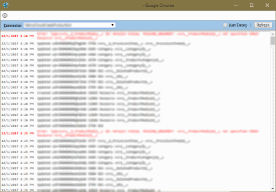

# connectorlog-bookmarklet

inRiver 6 connector log viewer
### Installation and usage
1. Create a new bookmark
2. Set the URL to the bookmarklet code
3. Log in to your inRiver 6 portal and invoke the bookmarklet.

Or,
1. Run the code from the devtools console in your browser.

You can hit F5 or refresh to load the most recent logs for the selected connector.

